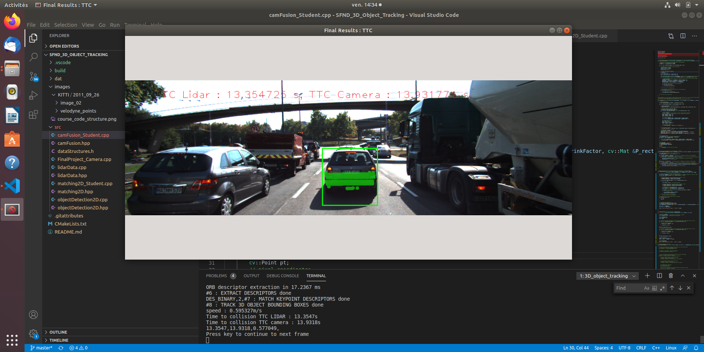
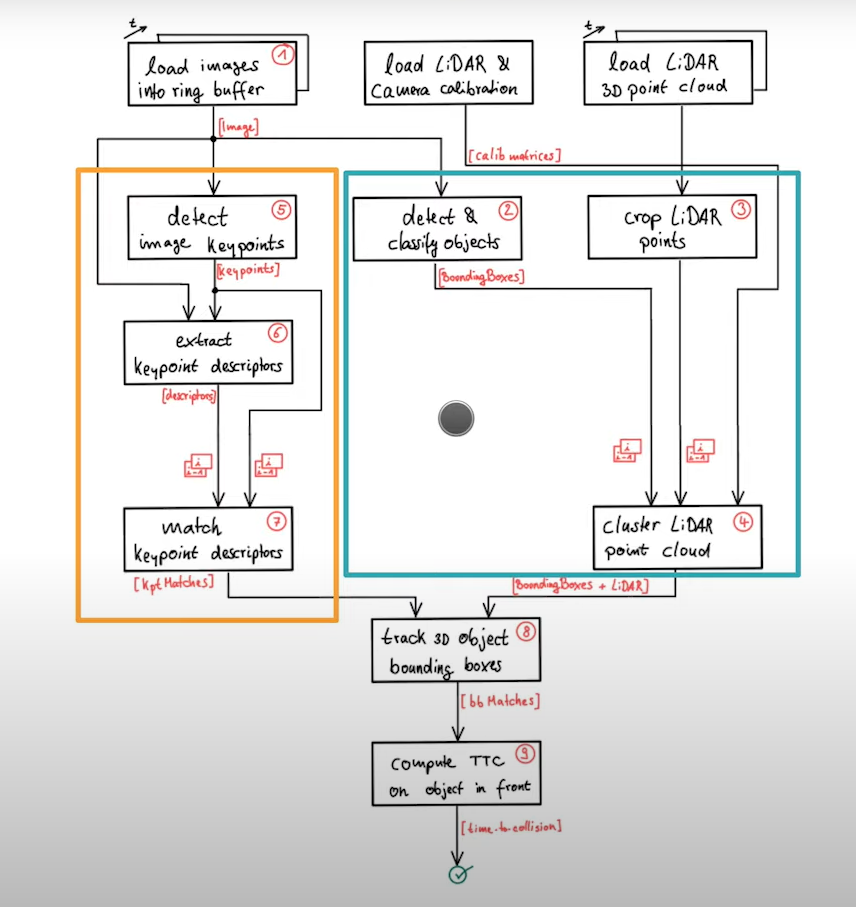
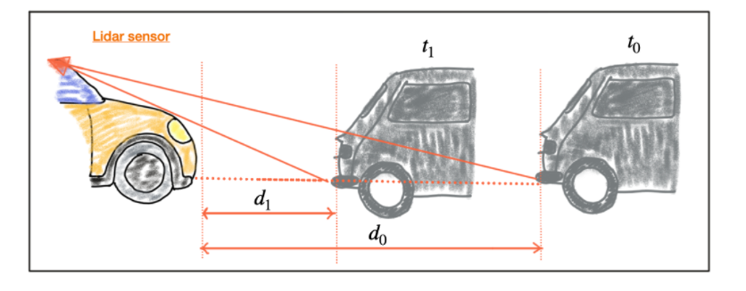
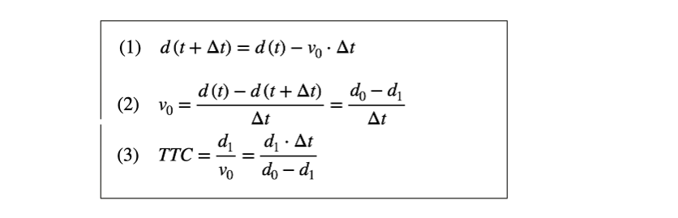
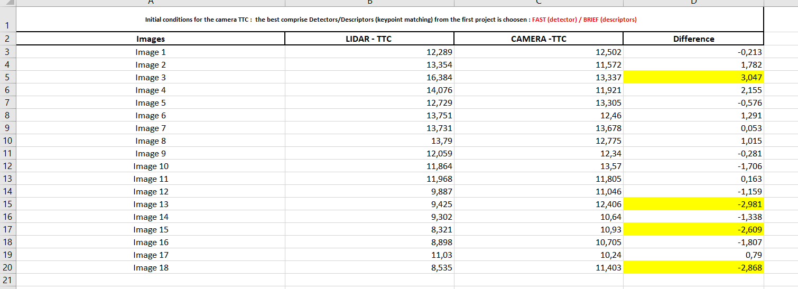
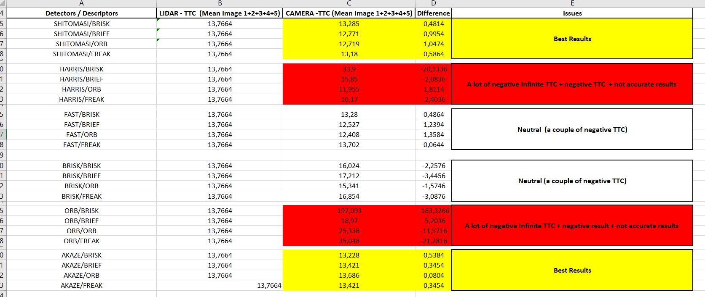

### 3D Object Tracking

- Tracking of 3D object bounding boxes over time : bounding boxes association between neighboring frames by looking the key points correspondences, which are in the bounding boxes

- Time To Collision calculation (TTC) with the Lidar and with the camera (only with the vehicle located in the ego lane)

--------------------------------

#### Global SW Architecture

1. Develop a way to match 3D objects over time by using keypoint correspondences. 

2. Compute the TTC based on Lidar measurements. 

3. Compute the TTC using a camera, which requires to first associate keypoint matches to regions of interest and then to compute the TTC based on those matches. 

4. Identification the most suitable detector/descriptor combination for TTC estimation and also to search for problems that can lead to faulty measurements by the camera or Lidar sensor. 

-----------------------------------

#### Preliminary

3 parts of global SW Architect has been already developed :
- 2D images features with the key points descriptors matching (implemented in the project SFND_2D_Feature_Tracking)
- Detection and Classification of the objects with 2D YOLO v3 with the creation of the bounding box (implementing during the course)
- Load/crop the 3D LIDAR points + Project the lidar points in the bounding box. THe bounding box will contain informations about location of objects and the respective lidar points(implemented during the course)

-------------------------------------

#### Match 3D objects
##### void matchBoundingBoxes(std::vector<cv::DMatch> &matches, std::map<int, int> &bbBestMatches, DataFrame &prevFrame, DataFrame &currFrame)

The target is to develop a way to track 3D Bounding Box. For that, it's useful to match 3D objects over time by using key point correspondences.
The name of the method is "matchBoundingBox". 
[input] : the previous and the current data frames + Key points correspondences without bounding box
[output] : the boxID (Bounding Box Id) with the highest number of correspondences.

The target is to find the BoxID with the highest number of correspondences.

2 Channel are used :
- the first channel (the key points matching from the camera data)
- the second channel(the bounding box from the 2D YOLO deep-learning framework (from the camera) and the LIDAR points (from the LIDAR) projected in the bounding box)

To reach this target, the code is composed about 5 steps :
- Iteration a loop over all the matches provides key point (comes from the descriptor/detector function)
- Inside the main loop : in all the bounding box in the previous frame, the keypoint located in every bounding box are found. 
- Inside the main loop : in all the bounding box in the current frame, the keypoint located in every bounding box are found. 
- Inside the main loop : the matching are store in a multimap. It's possible to see the associated keypoints from a specific box in the previous frame divided in different boxes from the current frame.
- Deliver a score for every bounding box in the current frame.

The last part is to find the best score for each box in the current frame for each box in previous frame.

----------------------------------------
#### Compute Lidar-based TTC
##### void computeTTCLidar(std::vector<LidarPoint> &lidarPointsPrev,std::vector<LidarPoint> &lidarPointsCurr, double frameRate, double &TTC)
 
The target is to compute the TTC based on Lidar measurements.
The two pictures presents the calculation of the TTC Lidar measurement. 
The implemented code searches for the closest point in the point cloud associated with T0 (lidarPointsPrev) and in the point cloud associated with T1 (lidarPOintsCurr). 
After finding the distance to the closest points respectively, the TTC is computed. 
 

------------------------------------------
#### Compute Camera-based TTC
##### void clusterKptMatchesWithROI(BoundingBox &boundingBox, std::vector<cv::KeyPoint> &kptsPrev, std::vector<cv::KeyPoint> &kptsCurr, std::vector<cv::DMatch> &kptMatches)
##### void computeTTCCamera(std::vector<cv::KeyPoint> &kptsPrev, std::vector<cv::KeyPoint> &kptsCurr,std::vector<cv::DMatch> kptMatches,double frameRate,double &TTC,cv::Mat  *visImg)

Before to calculate the camera based-TTC, the target is to associate the key points correspondences to the bounding boxes which enclosed the key points. 
The problem is the outliers : to release these, the key points must be closed to the mean of all the other key points in the bounding box. 
The mean will be the threshold to detect the outliers. 

The code is composed about 3 steps :
- Loop through all the keypoints enclosed in a boundingbox
- Calculation of the mean value of all euclidean distances between key point matches
- Reiterate the loop through all the keypoints to delete the outliers

 After that, the camera-based TTC is calculated, using keypoints correspondences from the matched bounding boxes between current and previous frame.
  
 -----------------------------------------

#### Performance Evaluation

The results are described below :
- For the Lidar-based TTC : in 4 case the difference between the camera and the lidar is more as 3 seconds : image 3, image 13, image 15, image 18.
The reasons are probably the presence of outliers. To resolve this problem, a best filter can be use to delete totaly the outliers.

- For the Camera-based TTC : the best compromise is with the key points detectors AKAZE. The results are optimal.
In other side, the detectors HARRIS and ORB give no good results : these detectors deliver negative Infinite TTC or negative TTC and the accuracy is not always optimal.

-------------------------------------------

### Dependencies for Running Locally
* cmake >= 2.8
  * All OSes: [click here for installation instructions](https://cmake.org/install/)
* make >= 4.1 (Linux, Mac), 3.81 (Windows)
  * Linux: make is installed by default on most Linux distros
  * Mac: [install Xcode command line tools to get make](https://developer.apple.com/xcode/features/)
  * Windows: [Click here for installation instructions](http://gnuwin32.sourceforge.net/packages/make.htm)
* Git LFS
  * Weight files are handled using [LFS](https://git-lfs.github.com/)
* OpenCV >= 4.1
  * This must be compiled from source using the `-D OPENCV_ENABLE_NONFREE=ON` cmake flag for testing the SIFT and SURF detectors.
  * The OpenCV 4.1.0 source code can be found [here](https://github.com/opencv/opencv/tree/4.1.0)
* gcc/g++ >= 5.4
  * Linux: gcc / g++ is installed by default on most Linux distros
  * Mac: same deal as make - [install Xcode command line tools](https://developer.apple.com/xcode/features/)
  * Windows: recommend using [MinGW](http://www.mingw.org/)

### Basic Build Instructions

1. Clone this repo.
2. Make a build directory in the top level project directory: `mkdir build && cd build`
3. Compile: `cmake .. && make`
4. Run it: `./3D_object_tracking`.
